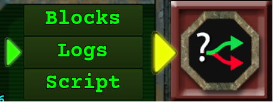

# Scripting

Manic Miner maps are text files ending in .DAT extension.

Since they are text files, they can be edited with any text editor. Just about any text format is allowed - the engine will read ASCII, UTF8 (with and without BOM) and UTF16 (with BOM) format files.  BOM are byte order markers and every decent text editor used by programmers will automatically deal with these so generally you don't have to worry about it.

Visual Studio Code and Notepad++ are the most common editors one would want to use to directly work with .DAT files.

Map files are organized into sections. Each section starts on a line with the section name followed by an open curly bracket. That is all that is on a line. Every following line is part of that section until a line only containing a closing curly bracket. If there are no lines between the open and closing curly brackets, the section is empty. For example:

```mms
info{
}
```

The map editor built into Manic Mainers will automatically fill in the various sections for you - and it even has a very simple text editor for the `script` section that is fine for very simple tasks. But once you start making more complex scripts, you will want to use a good text editor.

Two other sections indirectly work with the script section.
- `objectives` can refer to variables defined in the script section
- `blocks` can call EventChains in the script section.


Scripting is programmed map specific behavior that is defined by lines in the .MAP file `script` section. It has **three main components:**

- **Variables** are used to keep track of what's happening in the level.
- **Triggers** notify when something specific occurs in the level.
- **Events** are executed to alter gameplay in some way.

Events can be combined into sequence of events called Event Chains and they are the only way for a trigger to execute multiple statements (events).

Variables, Triggers, and Events use [Classes](_pages/Classes) to deal with objects in the gameplay.

Combined - script may respond to changes in the map and objects and record those changes or make gameplay changes based on interactions. For example when a miner in a vehicle drives over a location, the script could revel a new area of the map to explore.

Via script, one can make significant changes to the map itself. Any tile can be turned into any other tile, allowing creation and changes to lakes, rivers, walls, spawning monsters, etc. There are a few limitations:
- No changes to tile height. Height is set at map load time.
- No new automatic undiscovered caverns may be generated.
- No new miners, buildings and vehicles - only the user is able to create and interact with objects.
- No new landslides or erosions - they are set at map load time.
- No movement to any unit. The only movement control script has is the ability to set a flee location for creatures.

It is possible via script to dramatically affect the map which will affect gameplay. One could simulate lava and water floods, destroy bases and vehicles, spawn waves of monsters, change areas of the map to create new walls and paths, change available air, and many other things. 

Start by reviewing the [Scripting Structure](_pages/ScriptingStructure)

Reserved words are here: [Reserved Words](_pages/ReservedWords)

>The game provides a handy log that tells you exactly what has occurred and if any errors happen. Be aware that these are limited in number of events so fast timers or large scripts may exceed these limits making the debugging portion of your map more difficult. That said, scripts of tens of thousands of lines and thousands of event chains and variables do work as expected - so far no real limits have been discovered on size of script, number of event chains or variables.




To assist you with scripting the Level Editor can display the Row, Column and Tile ID of the tile beneath the mouse cursor. This function is activated when you press the Script Interface button in the Level Editor.

>If you notice something that's incorrect or require an update, come over to the **#Scripting** channel over on **[Discord](https://discord.gg/85k8JHz)**.

The script syntax will most likely confuse one at first - especially if one is familiar with modern free format programming languages. You cannot indent for readability - in general spaces are only allowed in a few specific places. There are no complex logical  conditions or expressions - in many ways those whom have had experience with assembly will notice many similarities.

>It is highly recommended that one review the demo scripts provided with the game to understand the syntax rules. If you are wondering if it is known how to do something - these would be the best place to start your search. These are found in the location where Manic Miners is installed in the following subdirectory path: ManicMiners\Levels\DEMO\Scripts

Additional formating rules are found in this set of documents.

## Links
 - [Manic Miners Discord](https://discord.gg/85k8JHz)
 - [Manic Miners Homepage](https://manicminers.baraklava.com/)
 - [Manic Miners Wiki](https://manicminers.fandom.com/)
