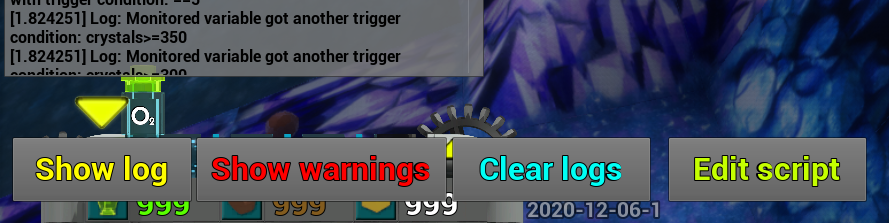
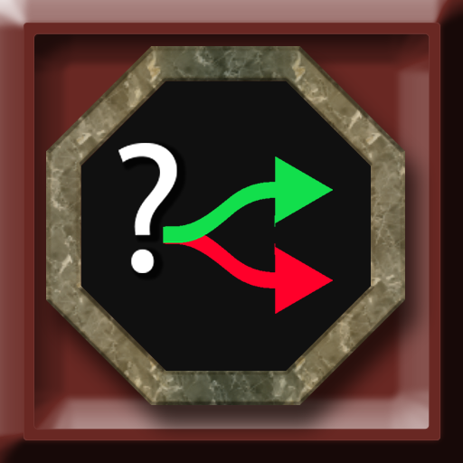

# Scripting

Scripting is programmed level-specific behaviour that is currently defined by inputting command lines in the level files' script section. It has **three main components:**

* **Variables**
* **Triggers**
* **Events**

**Variables** are used to keep track of what's happening in the level. **Triggers** check for when something specific occurs in the level. **Events** are executed to alter the level or player in some way.

?> The game provide a handy log that tells you exactly what has occured and if any errors happen.





To assist you with scripting the Level Editor can display the Row, Column and Tile ID of the tile beneath the mouse cursor. This function is activated when you press the Script Interface button in the Level Editor.

<p style="clear:both; float:none;" />

!> If you notice something that's incorrect or require an update, create a issue on **[Github](https://github.com/ManicMiners/docs/issues)** or come over to the **#Scripting** channel over on **[Discord](https://discord.gg/85k8JHz)**.

## Links
 - [Discord](https://discord.gg/85k8JHz)
 - [Manic Miners](https://manicminers.baraklava.com/)

# Level data file
The Level data file contains all the information needed to generate a level including scripting. Among other useful things it describes the [tile ID's](https://manicminers.fandom.com/wiki/Level_data_file#Tile_ID_list:)


```javascript
var s = "JavaScript syntax highlighting";
alert(s);
```

```mms
var s = "MMS syntax highlighting";
alert(s);
string stringtest="test"+"test2"

/* test */

miners test #class
miner test #variable
if(test) #occurrence

```


# Scripting Examples
Here you can find all sorts of examples to try and modify for your level.

## General Scripts

### A simple message
```clike
    string HappyBirthday="Happy birthday, cadet!"
	when(drill:2,2)[msg:HappyBirthday]
```
When any unit drill the wall in row 2, column 2, call the '''message''' event which in this case will display the text saved in the string variable '''HappyBirthday'''. As that string was defined above, drilling this wall wishes the player a happy birthday!

### Time based event
```clike    
	when(time:10)[place:6,7,11]
```
When `time` reaches 10 seconds, place a tile of water (ID 11) at row 6, column 7.

### Crystal count
```clike    
	int myCrystals=0
	string myStr="Crystals: "
	string myMsg

	if(crystals>=5)[myChain]
	myChain::;
	myCrystals=crystals;
	myMsg=myStr+myCrystals;
	msg:myMsg;
```
When you collect 5 or more crystals a message will appear once and display your currently collected 	crystals. This example includes an event chain.

### Increasing counter
```clike    
	int counter=0
	string myStr="Counter: "
	string myMsg

	when(click:6,6)[myChain]
	myChain::;
	counter+=1;
	myMsg=myStr+counter;
	msg:myMsg;
```	
Every time you click on the tile at row 6, column 6 the value of '''counter''' increases and a message is displayed with the new value. This example includes an event chain.

### Conditions inside Event Chains
```clike
	int myRow
	int myCol
	bool myBool
 
	init::;
	myRow=1;
	myCol=1;
	myBool=true;
 
	when(myBool==true)[DrillDrill]    #Drill the walls!
 
	DrillDrill::;
	myBool=false;
	drill:myRow,myCol;
	wait:0.1;
	((myCol>=6))myRow+=1;
	((myCol<6))[myCol+=1][myCol=1];
	((myRow<7))myBool=true;
``` 
The above example will drill out all the walls on a filled 8x8 map in less than 4 seconds!

## Class Scripts

### Class count
```clike
	when(drill:2,2)[msg:BuildingSupportStation_C]
```
When you drill a wall at position 2,2 a number indicating the total amount of constructed Support Stations will be displayed. This works with any class.

### Class gets teleported
```clike
	miner Charlie=3
	string MyString="Oh no! We lost Charlie!"
 
	when(Charlie.dead)[msg:MyString]
```
When miner *Charlie* dies a message will be shown.

### Class gets teleported 2
```clike
	vehicle Sofia=1
	string SofiaDied="Oh no! We lost Sofia!"
	string VehicleDied="We have lost a vehicle."
	string SmallDiggerDied="We lost a Small Digger!"
	
	when(Sofia.dead)[msg:SofiaDied]
	when(vehicle.dead)[msg:VehicleDied]
	when(VehicleSmallDigger_C.dead)[msg:SmallDiggerDied]
``` 
When you lose your `Small Digger` named Sofia you will get two messages; One because the named unit got teleported and one because class a unit of the vehicle class got teleported. `Sofia.dead` overrides `vehicle.dead` which means a third message will not be displayed even though we have 3 events in this example.