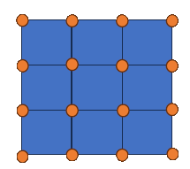

# DAT Section heights

The height section is required and written by the map editor on every save. It contains the height of every tile corner in the map. Tiles with shared corners only have a single height for the shared corner - thus the corners will start at the same height.

The section has one more row than the height of map. Each row has one more column than the width of the map. Thus a 3x3 map will have 4x4 heights.



There are rowcount+1 rows, each containing colcount+1 heights. Each height is a signed integer value followed by a comma. There are no spaces.

Height values are in 300 units per tile, so a height of 300 is one tile higher than 0 and -300 is one tile lower than 0. These are the same units returned by the X, Y, Z data members in script.

It is unknown if there is are maximum or minimum heights, by default new maps have all heights set to 0.

Generally the border values all have 0 for heights. Holes in textures are sometimes seen at the edges of the map if heights are non-zero. Border heights are only those on the outside. In the 3x3 map above, there are 12 border heights and 4 interior heights.

Example section for a 3x3 map where the inside is raised up.

```mms
heights{
0,0,0,0,
0,300,300,0,
0,300,300,0,
0,0,0,0,
}
```

Map heights are set during map load and remain the same during play - there is no way to modify heights dynamically during runtime.